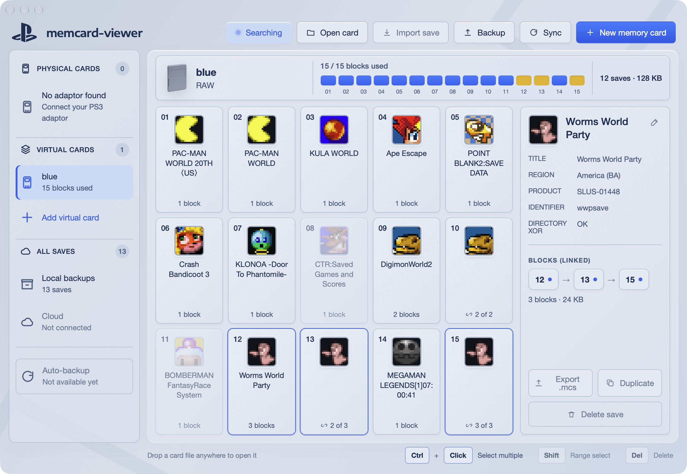

# memcard-viewer

A desktop PlayStation 1 memory card manager built with Tauri, React, and Rust. Browse all fifteen blocks, back up a whole card, export saves to a local library with version history, and compose a new card from selected saves.



*The macOS app displaying real saves and icons from `blue.mcr`, with Worms World Party’s linked blocks selected.*

## What works today

- **Fifteen-block gallery:** animated pixel icons, empty blocks, deleted saves, and linked continuation blocks in their physical positions, including non-contiguous chains.
- **Save inspector:** title, region, product code, identifier, linked blocks, and directory XOR checksum status.
- **Read-only game details:** the original twelve-game proposal now has useful summaries: FFVII, FFVIII, FFIX, Final Fantasy Tactics, Chrono Cross, Symphony of the Night, Gran Turismo 1/2, CTR, Spyro, Tekken 3 and Silent Hill. Choose **View game details** in card, local-save or snapshot inspectors. Multiple profiles and linked blocks are preserved, and checksum mismatches are reported. Support is limited to the exact tested releases in [save-details.md](docs/save-details.md), including English PAL FFVII (`SCES-00867`). Full inventory/editor coverage is not implemented.
- **Digimon World 2 pilot:** select an original US save (`SLUS-01193`) and choose **View game details** in the right inspector. Browse its three in-game profiles, tamer, rank, saved location, playtime, Bits, Digi-Beetle, and Digimon roster with stats and techniques. Also available for local backups and snapshots. Read-only; a mismatched game checksum is reported. Playtime matches the game’s hours/minutes display, including its 99:59 cap. Inventory and story progress are not decoded yet.
- **Mega Man Legends 2 pilot:** original US saves (`SLUS-01140`) show saved location, playtime to seconds, Zenny, health in stored units, named saved difficulty, and named equipped gear through the same dialog. All four game checksums are checked. All 25 save-location IDs and four starting difficulty modes are named; internal difficulty level 2 remains explicit. 45 equipment names are mapped. Inventory and story progress await mapping. See the [partial format specification](docs/formats/mega-man-legends-2.md).
- **Whole-card backup:** named, timestamped `.mcr` captures in the shared collection’s `card-backups/` folder, with selectable color thumbnails and a dedicated browser. Earlier backups are never overwritten.
- **Compose a card:** select saves and export a new raw `.mcr` with their linked blocks packed together.
- **Local save library:** export active saves as `.mcs`, browse them by game, and inspect preserved versions and capture sources.
- **Read physical cards:** Sony PS3 Memory Card Adaptor (`054C:02EA`), with read progress and automatic adaptor detection. Hardware access is read-only.

PS1 only: 128 KB and 15 save blocks. Supported card formats are raw `.mcr` and related formats, DexDrive `.gme`, and VGS `.vgs`/`.mem`. PS2, VMP, and MCX are not supported.

## Run locally

On macOS, install Node.js (22.12+), [Rust](https://rustup.rs/), the Xcode Command Line Tools, and libusb. The app targets macOS 13 or later.

```bash
xcode-select --install  # if the command line tools are not installed
brew install libusb
npm ci
npm run tauri -- dev
```

Open `blue.mcr` from the project root with **Open card…** under **Virtual Cards** in the sidebar. Card files and captures opened from **Card backups** stay loaded as separate virtual cards; select a row to switch, or its X to close it without changing the file. Import save, Backup, and Sync live in the top bar. Connecting or reconnecting the adaptor automatically reads **Slot 1**. Select Slot 1 to return to its loaded snapshot, or use its reload button for a fresh read. A card read does not automatically back up saves.

The web preview runs with `npm run dev` at `http://localhost:1420`. Card parsing, filesystem operations, and USB access require the desktop app. For a layout preview with explicitly synthetic icons and save data, visit `http://localhost:1420/?demo=1` in development mode.

## Back up or compose a card

Click **Backup**, name the card, choose its thumbnail color, and select **Back up card**. The complete image is saved automatically as a timestamped raw `.mcr` in your selected collection folder’s `card-backups/` subfolder, including deleted saves and unused blocks. No separate backup folder selection is needed. The completion banner offers **Reveal in Finder** and **View card backups**.

Open **Card backups** in the sidebar to browse captures, edit their names and colors, or reopen their fifteen blocks. Labels are JSON sidecars; editing them never changes card bytes. Color is chosen manually, including for backups read through the adaptor, and does not identify a physical card. Older backups without metadata use grey and show unknown capture time.

Click a save to select it; use **Cmd-click** on macOS or **Ctrl-click** to select multiple saves. **New card from selection** in the sidebar exports the selected saves to a new `.mcr` through a save dialog and opens the result as another virtual card. Linked blocks travel together. Loaded cards remain available for the current app session; restoring the workspace across app restarts is not implemented yet.

## Export saves with Sync

Open a card file or read Slot 1, then click **Sync** and choose a collection folder if one is not configured. Sync exports all active saves as `.mcs` files under `saves/`, in folders named by PS1 product code (`unknown-game` when missing). Names containing lowercase or unsafe characters are encoded to keep distinct PS1 filenames separate on case-insensitive filesystems. Each file contains the save directory header and all linked blocks in chain order.

The collection folder is remembered and shared by **Backup**, **Sync**, **Local saves**, and **Card backups**. If you selected a folder in the earlier save-backup flow, it becomes your collection folder automatically. The folder picker appears only if you have never selected one, or when you explicitly change it in Settings. On first setup or automatic migration, existing save files, hidden snapshot history, and the previous whole-card backup folder are copied into the new subfolders and verified. Changing the collection folder copies the existing collection in the same way. Originals are retained; a destination containing different data under the same filename stops setup without overwriting it. Later Sync runs update changed saves and skip identical contents. Files absent from the open card are retained; deleted saves are excluded. Sync exports the currently loaded snapshot, so reload Slot 1 first if the physical card has changed. It never writes back to the card.

### Preserved versions

Before replacing a latest dump, Sync preserves both the existing and incoming versions in `<game>/.snapshots/<save filename>/<content hash>.mcs`, with capture time and source information in a JSON sidecar. The ordinary `.mcs` remains the latest dump.

Identical contents reuse a snapshot, even when a save moves between blocks. Different contents under the same game filename remain separate versions. Capture sources identify loaded card images, not physical card serial numbers; the app does not infer which playthrough a version belongs to.

Snapshot publication requires filesystem hard-link support, such as APFS; FAT/exFAT destinations are not supported. If history cannot be safely written, Sync stops before replacing the affected latest dump. Keep each latest `.mcs` alongside its history: archived versions without a latest file are not currently listed in the library.

## Browse local backups

Choose your collection folder in **Settings**, then click **Local saves** under All Saves. The app recursively reads `.mcs` files and shows their icons, titles, game product codes, and block counts in a searchable catalog. Filter by game, sort by title, game code, or latest capture, and browse 24-save pages. Select a save for metadata and **Reveal in Finder**. The inspector’s **Snapshots** menu lets you inspect and reveal earlier versions; history files do not inflate the main save count.

Local saves and Card backups refresh when opened. In **Settings**, use **Refresh collection** after external changes, **Reveal in Finder** to open the collection folder, or **Change folder** to choose another directory. Unreadable files are reported while readable saves remain visible. Browsing the library leaves the open card and backup files untouched. Browse whole-card `.mcr` captures through **Card backups**, or use **Open card** for files elsewhere.

## Current limits

Automatic save backup, hardware write-back/two-way sync, cloud storage, persistent virtual-card management, and individual save import/export, rename, duplicate, and delete controls are not implemented. Unavailable controls remain visible and disabled. Manual **Sync** is a one-way export to a local directory.

## Development

```bash
npm test                           # Rust unit tests and Vitest
npm run build                      # TypeScript check and production web build
npm run tauri -- build --no-bundle  # native release binary
npm run tauri -- build --bundles app # macOS app bundle
```

Hardware integration tests are ignored by default and require a real adaptor and PS1 card. Application code is in `src/`; the Rust parser, backup/library logic, and USB implementation are in `src-tauri/src/`. [PRODUCT.md](PRODUCT.md) records scope and [DESIGN.md](DESIGN.md) records the visual system.

## License and credits

The twelve new summary decoders use pinned format references with license notices and documented validation boundaries in [docs/save-details.md](docs/save-details.md). Real shared completion/endgame save provenance and local test instructions are in [tests/fixtures/ps1](tests/fixtures/ps1/README.md).

The read-only Digimon World 2 decoder and name mappings are adapted from [acemon33/DW2-TT](https://github.com/acemon33/DW2-TT/tree/6325d60a628db4b0576d67162d059e653d59ea74), licensed GPL-3.0. Layout and checksum: `dw2_exp_multiplier/Entity/SaveFile.cs`; player-name encoding: `dw2_exp_multiplier/DigimonWorld2Tool/TextConversion.cs`; names and locations: `dw2_exp_multiplier/Resources/Vanilla/data.xml` and `config.xml`. Support is limited to the original US release; other regions and modified game formats need separate validation.

Playtime conversion was verified against [Wyrelade’s Digimon World 2 decompilation](https://github.com/Wyrelade/Digimon-World-2-Decomp/blob/cff2114139f0d93dd8fa94fa09600462ed9a35a2/src/stag1100/stag1100_301C.c) (`Stg11_CardMenuDraw`, CC0-1.0). The original US save stores a little-endian counter at profile offset `0x10`; the menu truncates it to minutes at 3,600 ticks per minute and clamps to 99:59. The `blue.mcr` fixture’s 217,430 ticks matches the user-confirmed in-game display of 01:00.

GPL-3.0-or-later. The parser is ported from [MemcardRex](https://github.com/ShendoXT/memcardrex) Core by Shendo; attribution remains with the parser. The bundled Encode Sans Expanded font is distributed under the [SIL Open Font License](src/assets/fonts/OFL.txt). The PlayStation monogram uses the Simple Icons CC0 silhouette. This is an independent project, not an official Sony application.
