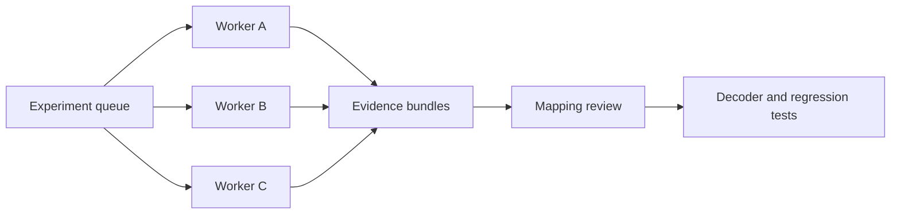

Prepared 10 October 2026. Pilot work completed 5 October 2026.

The Mega Man Legends 2 pilot established that we can turn unfamiliar PS1 saves into useful identification summaries. The research succeeded through a combination of binary inspection, game-code tracing, emulator observations, and public samples. Its main operational weakness was unreliable controller automation, which made the user part of the execution loop.

We recommend a small PCSX-Redux automation harness, first tested on Linux with a virtual display, followed by isolated workers that run independent experiments. Fully headless execution is a separate capability to qualify. Linux and container execution remain proposed; the completed pilot ran on macOS with DuckStation.

## What we accomplished

The production viewer now identifies original US Legends 2 saves by location, playtime, Zenny, health, difficulty, and equipped gear. It names 25 location IDs and 45 equipment entries, checks all four game checksums, and keeps unknown values explicit. Four difficulty names are mapped; internal level 2 remains unresolved. Both private saves identify as Nino Pad on Normal difficulty.

The pilot used two private saves and nine public save cards. At completion, 58 Rust tests, 21 frontend tests, five Python reader tests, and the separately invoked local corpus check passed. The rebuilt desktop dialog was inspected. The implementation and documentation were committed and pushed; these results establish the macOS pilot, not Linux emulator compatibility. The [format specification](https://github.com/bakkerme/memcard-manager/blob/2aa02de/docs/formats/mega-man-legends-2.md) records the evidence and limitations.

## How the research worked

1. **Normalize the input.** Distinguish a whole memory card from an individual MCS export, then reconstruct the save payload with the existing card parser. Hash originals and inspect copies.

2. **Trace storage.** Extract RAM from DuckStation states, disassemble MIPS routines, and follow the game's save packer and loader. This connected runtime values to file offsets and established checksum ranges.

3. **Confirm meaning.** Compare stored values with the game's load and equipment screens. Published equipment modifier tables supplied explicit ID mappings; walkthrough order alone could not establish indexes.

4. **Find broader coverage.** Inspect the game's full-width Shift-JIS location table and acquire labelled public saves for other difficulties. Cross-check names against table usage and observed map pairs.

5. **Ship a narrow reader.** Implement verified fields, retain unknown IDs, document provenance, and test container round trips, checksum warnings, malformed input, and input preservation.

The most reusable part was the combination of direct storage tracing and independent observations. Screenshots explained visible meaning; code established where that meaning was stored.

## Cheat tables as a research starting point

Cheat tables were useful in the Legends 2 pilot and should be part of the initial research for each game. They supplied candidate RAM addresses for Zenny, health, time, and equipped gear. For example, the published armor modifier pointed to RAM address `0x8008C254`; tracing the game's save/load code connected it to save offset `0x2b6`. [GameHacking codes](https://gamehacking.org/game/89272).

Explicit hexadecimal equipment modifier tables also supplied the ID/name mappings for the 45 equipment entries now displayed. Five nonzero equipped IDs were independently checked against the user's Equipment screen; the remaining names are documented mappings. Walkthrough or catalog order alone cannot establish an ID. [Skatr11718's modifier tables](https://www.cheatcodes.com/guide/walkthrough-megaman-legends-2-playstation-13555/).

No cheat was applied during the pilot. Published RAM codes provide leads: they do not establish save offsets, persistence, or inventory ownership. The next process should:

1. Collect codes and ID tables matching the disc region and revision, retaining source and author attribution.

2. Record candidate addresses, value widths, ID mappings, and confidence, then use them to plan experiments.

3. Trace serialization and validate candidate meanings through scripted observations and controlled save/reload comparisons.

Once the harness works, cheats or memory patches could help reach expensive test states on disposable card copies. Record those samples as modified and verify their behavior through in-game saving, reloading, and UI observations; a successful patch alone is insufficient. This approach should reduce exploration effort, especially for equipment mappings, although its time savings have not been measured.

## Issues and lessons

| Issue in the pilot | Lesson for the next run |
| - | - |
| Controller key presses were unreliable through the available macOS UI automation. The user opened the menu and switched to Equipment. | Use emulated controller APIs; desktop window focus must not be a prerequisite. |
| Early text searches missed full-width Shift-JIS names, and overlay changes altered the code at the same RAM address. | Decode game encodings and record the loaded scene or overlay with every capture. |
| A stored counter used 60 Hz despite 30 FPS rendering; a second counter had different semantics. | Trace the display calculation instead of inferring units from rendering or similar values. |
| Public downloads sometimes rejected command-line requests. Some uploads duplicated another save; a Normal-labelled endgame stored Hard. | Acquire samples once, hash and deduplicate payloads, and treat upload descriptions as evidence to check. |
| Emulator-state extraction depended on a particular DuckStation version; the running app initially showed an older build. | Pin tool versions and verify the exact executable under test. |
| Interactive observations and experiments were assembled through individual tool calls. | Persist action recipes and evidence bundles so retries do not require reconstructing the session. |

A passing checksum proves consistency with the checksum algorithm, not unmodified gameplay or a correct interpretation. Public max-stat saves helped cover difficulty IDs, but were not independent evidence of natural progression. We recorded no controlled timing benchmark, so speedup claims would be premature.

## Emulator choice and Linux execution

**PCSX-Redux is the first candidate.** It publishes Linux x64 and ARM64 builds. Lua exposes controller overrides, state serialization, memory access, and game-screen capture; emulated-vsync callbacks can support frame-counted action recipes. These capabilities fit save research, but exact stepping, rendering, and Legends 2 compatibility need qualification in the selected build. [Project](https://github.com/grumpycoders/pcsx-redux), [Lua API](https://pcsx-redux.consoledev.net/Lua/redux-basics/), [events](https://pcsx-redux.consoledev.net/Lua/events/).

There are two deployment modes:

- **Virtual-display worker:** run the graphical emulator under Xvfb, with Mesa software rendering where supported. A physical monitor and desktop operator are unnecessary, while the graphical execution path remains available for screenshots and HTTP states. This is the proposed first container prototype; verify its OpenGL and audio configuration. [Mesa LLVMpipe](https://docs.mesa3d.org/drivers/llvmpipe.html).

- **Worker without a GUI:** evaluate `-no-ui` or `-cli`, loaded Lua scripts, and Lua state serialization. The built-in HTTP state endpoints are explicitly unavailable without the GUI. Screenshot and rendering behavior must be tested independently; removing the GUI does not certify the complete workflow. [CLI flags](https://pcsx-redux.consoledev.net/cli_flags/), [HTTP API](https://pcsx-redux.consoledev.net/web_server/).

RetroArch is a fallback with network execution and memory commands plus separate Remote RetroPad input. BizHawk is another Linux candidate with mature scripting, but is Windows-centric and carries more frontend/runtime dependencies. Neither has been qualified for our container workflow. [RetroArch commands](https://docs.libretro.com/development/retroarch/network-control-interface/), [controller input](https://docs.libretro.com/library/remote_retropad/), [BizHawk platforms](https://github.com/TASEmulators/BizHawk).

## A process that can run in parallel

Use one emulator process per experiment, driven by a Python coordinator and a small Lua adapter. The agent plans experiments and interprets results; the adapter performs repeatable input and capture operations.

Each worker gets its own configuration, writable card copies, states, output directory, and virtual display or internal port. ROMs, BIOS, and seed samples are mounted read-only and supplied separately from the container image. Prefer an extracted executable or pinned source build to adding FUSE privileges for an AppImage.

Define commands such as press/release, run a bounded number of emulated frames, wait for a memory condition, capture the screen, read memory, save/restore a state, and export the resulting card. Include acknowledgements, deadlines, and an action log. Release buttons after failed actions. The REST server defaults to all network interfaces, so keep it inside the worker's private network and publish no host port. [HTTP behavior](https://pcsx-redux.consoledev.net/web_server/).

A job restores both a baseline state and its matching card copy, changes one gameplay variable, saves through the game, waits for card writes to finish, and exports a before/after comparison. A memory patch can explore a hypothesis, but cannot alone validate an equipment selector or legitimate save behavior.

Parallelize independent games, samples, or branches from that baseline. Keep dependent gameplay steps sequential inside each worker. Start with two workers, set CPU/memory limits, and measure throughput before increasing concurrency. Software rendering can consume several CPU threads; worker count should follow measurements rather than logical-core count.

## Evidence and rollout criteria

Every job should retain input hashes, disc release/revision, emulator build and settings, recipe version, baseline state/card hashes, frame counts, screenshots, relevant RAM ranges, output save hashes, checksum results, byte differences, and failure logs. Group duplicate samples by payload hash. Classify findings as traced storage, table-derived name, observed game label, or hypothesis. Promote mappings only when evidence supports their meaning.

First qualify one Linux worker: load the existing save, open the menu and switch tabs through scripted input, capture the result, restore the baseline, and reproduce it. Then perform one controlled equipment change and a valid in-game save without touching originals. Next run two isolated jobs simultaneously and confirm their cards and artifacts never mix.

Only after those gates should we expand to a sample queue, add per-game recipes, or pursue a fully headless backend. Track user interventions, job success rate, replay consistency, and time per validated mapping. Complete a small batch without user intervention before claiming that the manual bottleneck has been removed.
